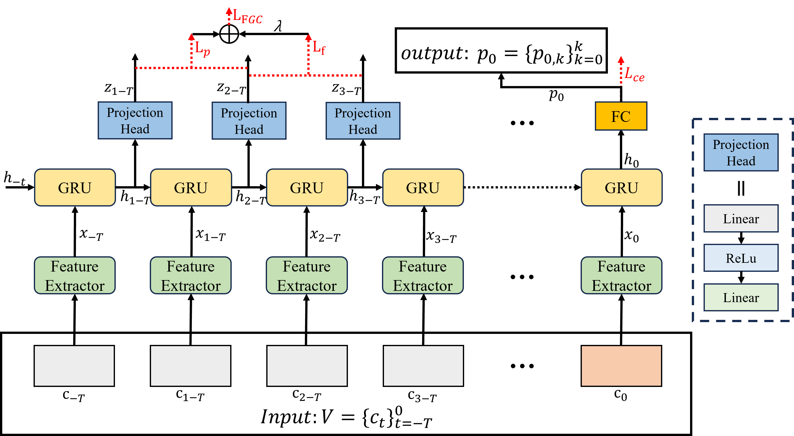
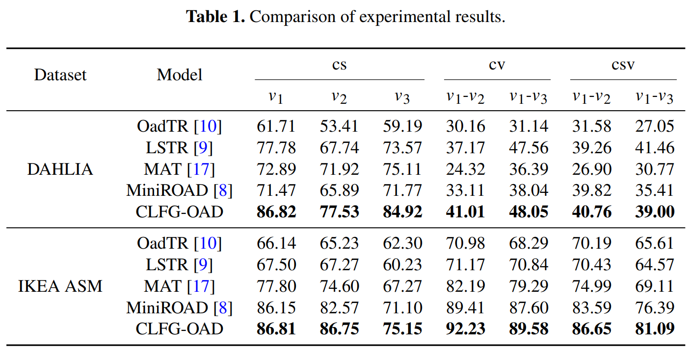

# ISAIR 2025 - Cross-View Online Action Detection via Contrastive Learning with Future Frame Guidance

## Code
This project is built upon [MiniRoad](https://github.com/jbistanbul/MiniROAD).
Please refer to the original repository for configuration details.

## 1、Model architecture diagram
This is our PyTorch implementation of the paper "[`Cross-View Online Action Detection via Contrastive Learning with Future Frame Guidance`](https://doi.org/10.1007/978-981-95-4821-7_22 )" published in ***2025 International Symposium on Artificial Intelligence and Robotics (ISAIR)***.

## 2、Selected experimental results

## Author's Contact
Email：yang_lu@seu.edu.cn
